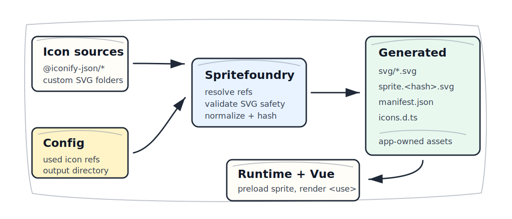

# Spritefoundry

Effect-first TypeScript tooling for turning selected Iconify and custom SVG icons into an app-owned SVG sprite, manifest, and typed icon names.

Status: alpha.

## Problem

Icon libraries are useful, but app builds often need stricter control: only used icons, local source resolution, deterministic generated files, typed icon names, and runtime loading that does not fetch third-party icon services.

## Solution

Spritefoundry resolves explicit icon refs from installed Iconify JSON packages and local SVG folders, validates SVG safety, writes normalized SVGs, emits a hashed sprite, generates a manifest and TypeScript icon-name types, and provides CLI, Vite, runtime, and Vue integration.



## How It Works

1. Configure local icon sources and explicit used icons.
2. Build through the CLI or Vite plugin.
3. Resolve icons from installed packages and custom SVG folders.
4. Validate and normalize SVG content.
5. Emit `svg/`, `sprite.<hash>.svg`, `manifest.json`, and `icons.d.ts`.
6. Load the generated sprite from app-owned assets at runtime.

## Install

```sh
pnpm add -D @nicksuomi/spritefoundry @nicksuomi/spritefoundry-cli @iconify-json/lucide
pnpm add @nicksuomi/spritefoundry-vue
```

Optional Vite integration:

```sh
pnpm add -D @nicksuomi/spritefoundry-vite vite
```

## Minimal Config

Create `spritefoundry.config.json`:

```json
{
  "iconifySources": [
    {
      "name": "lucide",
      "packageName": "@iconify-json/lucide"
    }
  ],
  "customSources": [
    {
      "name": "brand",
      "directory": "icons/brand"
    }
  ],
  "icons": [
    {
      "name": "home",
      "ref": "lucide:home"
    },
    {
      "name": "logo",
      "ref": "brand:logo"
    }
  ],
  "output": {
    "directory": "dist/icons"
  }
}
```

Custom SVG files must include one `<svg>` root and a numeric `viewBox`. See [SVG policy](docs/svg-policy.md).

## CLI

```sh
pnpm spritefoundry build --config spritefoundry.config.json
```

The CLI writes:

- `svg/<icon>.svg`
- `sprite.<hash>.svg`
- `manifest.json`
- `icons.d.ts`

## Vite

```ts
import { defineConfig } from "vite"
import { spritefoundryVite } from "@nicksuomi/spritefoundry-vite"

export default defineConfig({
  plugins: [
    spritefoundryVite({
      config: {
        iconifySources: [{ name: "lucide", packageName: "@iconify-json/lucide" }],
        customSources: [{ name: "brand", directory: "icons/brand" }],
        icons: [
          { name: "home", ref: "lucide:home" },
          { name: "logo", ref: "brand:logo" }
        ],
        output: {}
      }
    })
  ]
})
```

The plugin runs during Vite build and writes Spritefoundry outputs into Vite `outDir`.

## Runtime

```ts
import manifest from "./icons/manifest.json"
import { createSpriteLoader } from "@nicksuomi/spritefoundry"

const loader = createSpriteLoader({ manifest })
const state = await loader.load()

if (state.status !== "ready") {
  console.error(state.error)
}
```

The loader fetches only `manifest.sprite.publicPath`, unless the app passes an explicit sprite URL.

## Vue

```ts
import { createApp } from "vue"
import manifest from "./icons/manifest.json"
import { createSpritefoundryVue } from "@nicksuomi/spritefoundry-vue"
import App from "./App.vue"

const app = createApp(App)
const spritefoundry = createSpritefoundryVue({ manifest })

app.use(spritefoundry)
await spritefoundry.preload()
app.mount("#app")
```

```vue
<template>
  <SpriteIcon name="home" title="Home" />
</template>
```

For non-manifest symbol IDs, opt in explicitly:

```vue
<template>
  <SpriteIcon name="external-symbol-id" passthrough />
</template>
```

## Security And Offline Guarantees

- Normal builds read installed Iconify JSON data and local custom SVG files.
- Runtime helpers fetch only the generated sprite asset owned by the app.
- SVG input is rejected when it contains active or external content.
- Generated sprite filenames include a content hash.
- pnpm hardening is part of the repo contract and must not be weakened.

## Comparison

Spritefoundry sits between Iconify data tooling, SVG sprite generators, Vite plugins, and runtime icon components. It is for apps that want explicit used-icon config, local Iconify/custom SVG resolution, generated sprite artifacts, typed icon names, and a small runtime loader.

| Tool | Good at | Spritefoundry differs by |
| --- | --- | --- |
| [Iconify Tools](https://iconify.design/docs/libraries/tools/) | Importing, exporting, parsing, cleaning, and validating icon sets. | Turning selected installed Iconify/custom refs into app-owned sprite, manifest, and TypeScript outputs. |
| [Iconify Vue](https://iconify.design/docs/icon-components/vue/) and [unplugin-icons](https://github.com/unplugin/unplugin-icons) | Rendering Iconify icons as framework components, including on-demand component workflows. | Prebuilding a hashed sprite and manifest so runtime fetches stay limited to app-owned assets. |
| [svg-sprite](https://github.com/svg-sprite/svg-sprite) | Low-level SVG file to sprite generation with stylesheet outputs. | Adding Iconify JSON source resolution, explicit used-icon config, typed manifest output, and runtime loading helpers. |
| [vite-plugin-svg-icons](https://github.com/vbenjs/vite-plugin-svg-icons) | Fast SVG sprite generation inside Vite builds. | Keeping the core pipeline usable through CLI, Vite, and Vue packages with the same manifest contract. |
| [SVGO](https://svgo.dev/docs/introduction/) | Optimizing SVG files. | Enforcing conservative SVG safety policy and packaging selected icons; it is not a general SVG optimizer replacement. |

## Architecture And Policy

- Architecture: [ARCHITECTURE.md](ARCHITECTURE.md)
- SVG safety: [docs/svg-policy.md](docs/svg-policy.md)
- Extended usage notes: [docs/usage.md](docs/usage.md)
- Effect package decision: [docs/adr/0001-effect-v4-beta-and-pnpm-hardening.md](docs/adr/0001-effect-v4-beta-and-pnpm-hardening.md)
